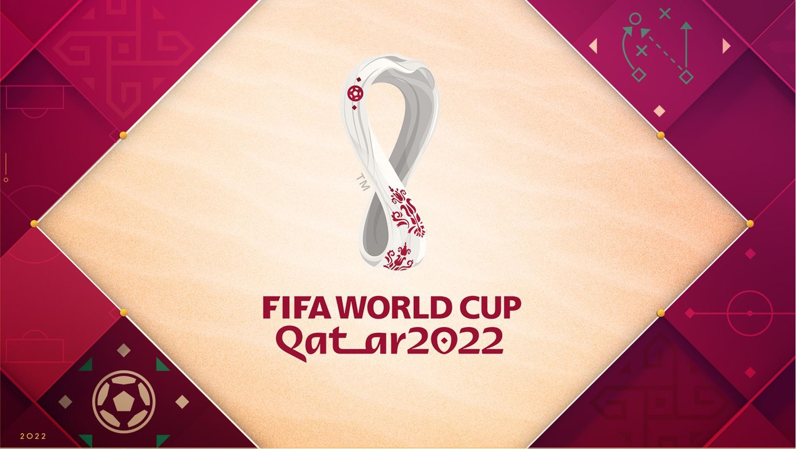

# FiFA-World-Cup-Challenge

> Can you predict who will win FIFA World Cup Qatar 2022 using Machine Learning?



This is the course project of 18797 CMU, named FIFA World Cup Challenge

Team Members: Fan Yang, Fuyu Tang, Changsheng Su, Chongyi Zheng. Thanks for your time and effort!

## Abstract

FIFA World Cup [1] is the most famous football competition in the world and it will be held from Nov 20, 2022 to Dec 18, 2022 [2]. In this project, we want to predict results of the quarterfinals as well as the exact goals scored by each team. Aiming at those goals, we need to leverage massive amounts of data from historical tournaments of each team and ratings of individual players, which is well-suited for machine learning approaches. Specifically, predicting results can be modeled as a classification problem and predicting goals scored by each team can be modeled as a regression problem. To evaluate our method, we will use data from FIFA World Cup 2018 as validation and finally test prediction accuracy on FIFA World Cup 2022 quarterfinals.

## Prerequisites

1. Prepare the prerequisites

   ```python
   pip install -r requirements.txt
   ```

2. The directory structure of this project:

   ```python
   .
   ├── README.md
   ├── data
   │   ├── V1
   │   ├── V2
   │   └── raw_data
   ├── data_preparation.py
   ├── models
   ├── models.py
   ├── pic
   ├── requirements.txt
   ├── train.py
   └── utils.py
   ```

## Data

1. This project right now is using [FiFA World Cup](https://www.kaggle.com/datasets/abecklas/fifa-world-cup?resource=download&select=WorldCupMatches.csv) dataset from Kaggle

2. To preprocess the data

   ```python
   python data_preparation.py
   ```

3. 

## Usage

1. Train and evaluate ML models on WorldCup dataset

   ```python
   python train.py --model KNN
   ```

   Some important arguments (listed below, more could be found in `train.py`):

   | Argument     | Default     | Description                                       |
   | ------------ | ----------- | ------------------------------------------------- |
   | --model      |             | ML models for training and evaluation: ['KNN', ]. |
   | --data-dir   | './data'    | Directory path for data set.                      |
   | --train-file | 'train.pkl' | Training set file name.                           |
   | --val-file   | 'val.pkl'   | Validation set file name.                         |
   | --test-file  | 'test.pkl'  | Testing set file name.                            |

2. 

## Results

1. Results for regression-based model

   | Model | Scale    | Test MSE on V1 | Test R2   on V1 | Test ACC on V1 | Test MSE on V2 | Test R2  on V2 | Test ACC on V2 |
   | :---: | :------: | :------------: | :-----------: | :------------: | :-----------: | :------------: | :------------: |
   | PR    | Standard |     2.1654     | -1.1983 | 0.5 | 1.4530 | -1.2368 | 0.5 |
   | RF    | None     | 2.2198 | -1.2657 | 0.25 |                |                |                |
   | GB    | None     | 2.1726 | -1.2065 | 0.25 | 1.9732 | -0.9924 | 0. |
   | KRR   | Standard | 2.1813 | -1.2546 | 0.5 |               |                |                 |
   | LGB   | MinMax   | 2.0754 | -1.1583 | 0.5 | 1.3259 | -0.1720 | 0.5 |

   

2. Results for classification-based model

   

2. 

## References

[1] Nam-Su Kim and Laurence Chalip. Why travel to the fifa world cup? effects of motives, background, interest, and constraints. *Tourism management*, 25(6):695–707, 2004.

[2] Wikipedia. FIFA World Cup — Wikipedia, the free encyclopedia. http://en.wikipedia. org/w/index.php?title=FIFA%20World%20Cup&oldid=1111687599, 2022. [Online; ac- cessed 30-September-2022].

